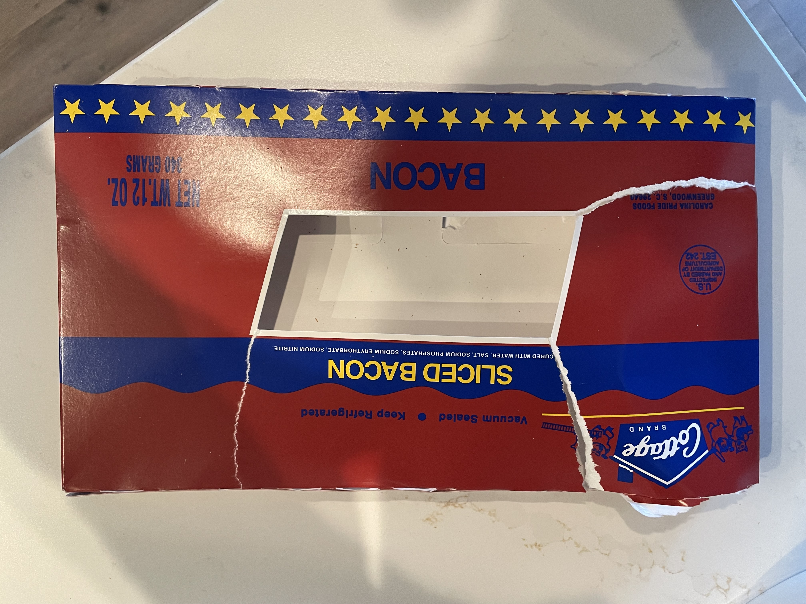

# Bacon Binge
Welcome to Bacon Binge! 🥓 Your one-stop shop for grocery outlet bacon reviews. Because life’s too short for expensive bacon! Let’s see if those budget-friendly slices are worth the price—or if they’re just a slice of heaven in disguise! (Thanks AI)

This site is basically sponsored by the United Grocery Outlet. Where bacon is usually $3. 

Hormel and Oscar Mayer were the highest rated. Should out to Walmart and (again) Hormel (low sodium). 

Take ratings with a drop of grease. This is the most informal rating system ever. Our family of 5 all get a say in this. Three of us are under 10 years old. 

At the end of the day… the best bacon is the one right in front of you. Unless you’re Garnet Valley. 

## Wellshire
Dates: 11 May 24, 18 Jan 25, 2 Mar 25
Rating: 4/5
Overall: Thumbs Up
Cooked: Cast iron and stainless steel pan
Comments: Solid, crunchy

## Hormel Natural Choice
Dates: 25 May 24, 6/16/24
Rating: 4.5/5
Overall: Thumbs Up
Cooked: Cast iron
Comments: Salty, crunchy. Liked by the Hinson parents as well.

## Garrett Valley Farms - all natural sugar free dry rubbed
Dates: 22 Jun 24, 23 Jun 24
Rating: 2/5
Overall: Eh
Cooked: Hunter’s Blackstone. Oven w/ no grate.
Comments: Color was off. Not salty. Thin. Overall lacks flavor.

## Ole Carolina - Hardwood smoked Sliced Bacon
Dates: 6 Jul 24
Rating: 3.5/5
Overall: Solid, but not spectacular. Would buy again.
Cooked: Microwave
Comments: Just Ok on saltiness. Pieces didn’t shrink too much, but were kind of hard. Not a lot of smokiness. Emilio really liked it.

## Jimmy Dean Hickory Smoked Premium Bacon 
Dates: 15 July 2024, 21 Jul 24
Rating: 4/5
Overall: Thumbs Upcontain
Cooked: Griddle on grill
Comments: Good saltiness. Didn’t shrink when cooked. Nice and crispy. Not tough. Nice color. Could have used more smokiness. 

## Hormel Black Label Lower Sodium
Dates: 11 Aug 24
Rating: 4.25/5
Overall: Thumbs Up
Cooked: Metal grate in oven
Comments: very well liked considering I thought it was undercooked. Mari especially liked it a bit chewy. It was maybe slightly low on salt (Lower Sodium and all), but not enough to knock down the ratings. Didn’t shrink too much while cooking. 

## Oscar Mayer
Date: 3 Sep 24
Rating: 3.4/5
Overall: Thumbs Up
Cooked: Microwave
Comments: Cooked while in vacation. Microwave made it tough. Lacked salt. It was fine. Nothing special. 

## Oscar Mayer Naturally Hardwood Smoked Center Cut
Dates: 4 Sep 24
Rating: 4/5
Overall: Thumbs Up
Cooked: Microwave
Comments: First had it while on vacation in Seriveville. Kids really liked it. I thought it was a bit thin and needed a pinch more of salt.
  

## Oscar Mayer Naturally Hardwood Smoked Center Cut
Dates: 7 Sep 24
Rating: 4.5/5
Overall: Thumbs Up
Cooked: Cast Iron Skillet
Comments: Second time trying this bacon. Previous complaints about lack of salt and being thin disappeared. Lacked a bit of smokiness Overall still enjoyed by everyone. 

## Jamestown Brand Sliced Bacon Hardwood Smoked
Dates: 29 Sep 24
Rating: 3.5/5
Overall: Thumbs Up
Cooked: Cast Iron Skillet
Comments: Not great. Not bad. Color and texture were good. A bit salty. Good considering it was their “Value Bacon” 🤣.

## Walmart Naturally Hickory Smoked Thick Sliced
Dates: 29 Sep 24, 17 Nov 24
Rating: 3.75/5
Overall: Thumbs Up
Cooked: Masterbuilt Griddle
Comments: Good texture and chew. A bit salty. 

## Elm Hill Hardwood Smoked Sliced Bacon
Dates: 10 Nov 24
Rating: 4.25/5
Overall: Thumbs Up
Cooked: Microwave
Comments: All around great taste. Really well liked even though it was cooked in the microwave. We did deduct a quarter point for irregularly sized pieces. 

## Bryan Thick Cut Bacon
Dates: 14 Dec 24
Rating: 4
Overall: Thumbs Up
Cooked: Wire rack in oven
Comments: overall solid. Nice shapes and thickness. Enough salt. Good smoke taste. Hinson parents liked it as well. 

## Cottage Brand - Sliced Bacon
Dates: 17 Feb 2025
Rating: 2/5
Overall: Taste was OK. It was thin. Lots of fat rendered leaving small pieces. It was churchy. 
Cooked: Cast Iron pan
Comments: Nobody’s favorite. 

## Things to add before publishing
- [ ] Remove this
- [x] H1 for a description
- [x] Remove publishing note at the end
- [ ] Find annoying bacon background (repeating SVG)
- [x] Bold text before :. Use regex with text? -> Add class
- [x] Pull images to the right and smaller. Inline with text.
- [x] Maybe an 8-bit font for text
- [x] Add badges. Uses renderer + regex + badges
- [x] Fix images
- [x] Load from md file
- [ ] Add List Group 
- [ ] Look at why comments don't always work

## Technical Data
Bacon rating, comments, dates, etc are kept using [FlatNotes](https://github.com/dullage/flatnotes) that's locally hosted. A series of scripts copies the markdown file and images to a different directory. This is done by a cron job. That directory is mapped to a Docker container that hosts this HTML page. This container is exposed to the interwebs using Tailscale. Tailscale keeps my IP hidden. Docker isolates the container. 